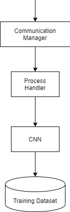
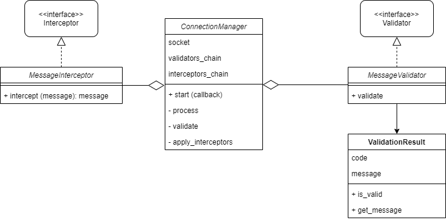
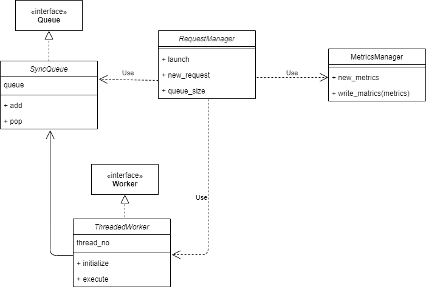
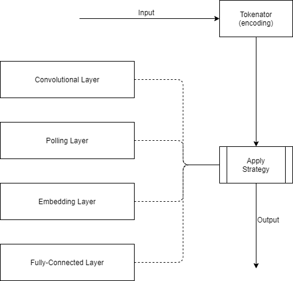

# CNN Detection component

The overall workflow in this component is defined as follows:



Here's an in depth look over the above modules

## CommunicationManager

CommunicationManager is the class responsible for establishing server functionality and binding to a given port. It
will receive messages, validate them, and even modify the input if needed before sending it further to
the ProcessHandler



### Members

`Interceptor` A class that will recieve the input message and can apply any aditional logic transform/log/measure certain aspects.
The ```ConnectionManager``` will have a chain of interceptors that it will apply in the same order they were registered.

`Validator` A class used for validating the input received from the user. It performs syntactic validation.

## ProcessHandler

The ```RequestManager``` class handles the processing queue, specifically usefull for bulk processing in case of large inputs.
Given a ```Worker``` implementation, the request manage will process each request while recording metrics for benchmarking purposes.



### Members

`Queue` The container used for storing the received requests. Normally a simple queue, that can be threadsafe or not depending on the ```Worker``` implementation.

`Worker` The actual execution logic, that can be either based on threads or coroutines.

`MetricsManager` A class used to generate metrics objects, that can be passed along the processing chain and record data needed for benchmarking.
Once a metrics object is destroyed or the ```write_metrics``` function is called, the recorded data is flushed to the configured output stream

## CNN

The convolutional neural network is the actual detection algorithm used by this module. For this specific module,
we are using the approach described [here](https://arxiv.org/pdf/1802.09957.pdf).


